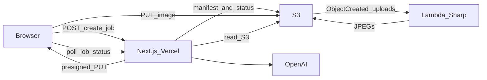

# Meme Studio

Serverless meme generator: **Next.js** (Vercel) for the UI and APIs, **OpenAI** for captions, **Amazon S3** for storage and job state, and **AWS Lambda** with **Sharp** to render three share-ready JPEGs after a direct browser upload.

**Highlights**

- No long-lived app server; job metadata and pipeline state live in S3 as JSON.
- Browser uploads go straight to S3 via presigned `PUT`; secrets stay on the server.
- One Lambda handles image work; optional public read for `outputs/*` if you configure it.



## Flow in brief

1. **`POST /api/create-job`** — Validates input, asks OpenAI for three top/bottom caption pairs, writes `jobs/{jobId}/manifest.json` and `jobs/{jobId}/status.json`, returns a presigned upload URL for `uploads/{jobId}/original.{ext}`.
2. **Browser** uploads the image to S3.
3. **S3** fires **Lambda** on the `uploads/` prefix; the worker (see [`lambda/index.js`](lambda/index.js)) reads the manifest and original, composites text with Sharp, writes `outputs/{jobId}/meme-1..3.jpg`, updates `status.json` to completed or failed.
4. **`GET /api/job-status`** — Returns status plus presigned GET URLs for outputs (or stable public HTTPS URLs if you opt in).

## S3 layout

- `uploads/{jobId}/original.{ext}` — Upload target; Lambda trigger should watch this prefix only.
- `jobs/{jobId}/manifest.json` — Captions and input metadata (written by Vercel).
- `jobs/{jobId}/status.json` — Pipeline state and output keys (Vercel seeds `pending`; Lambda updates).
- `outputs/{jobId}/meme-{1..3}.jpg` — Rendered memes (private by default).

## Quick start

```bash
cp .env.example .env.local
# Set AWS_*, S3_BUCKET_NAME, OPENAI_API_KEY (see Environment below)
npm install
npm run dev
```

Open [http://localhost:3000](http://localhost:3000). Without `OPENAI_API_KEY`, local development uses short placeholder captions; production-like environments should set a real key.

## Scripts

- **`npm run dev`** — Local dev at [http://localhost:3000](http://localhost:3000)
- **`npm run build`** — Production build (same as Vercel)
- **`npm run start`** — Serve the production build
- **`npm run lint`** — ESLint (Next.js config)

## Environment

Copy [`.env.example`](.env.example) to `.env.local`. Never commit `.env.local` (it is gitignored). If keys were ever exposed, rotate them in AWS and OpenAI.

**Server (Vercel or Node)**

- **`AWS_REGION`** — S3 client and signing.
- **`AWS_ACCESS_KEY_ID`** / **`AWS_SECRET_ACCESS_KEY`** — Often set in Vercel; locally you can rely on the default credential chain instead.
- **`AWS_SESSION_TOKEN`** — Optional; use with temporary or assumed-role credentials.
- **`S3_BUCKET_NAME`** — Target bucket.
- **`OPENAI_API_KEY`** — Required when `VERCEL=1` or `NODE_ENV=production`; optional locally for placeholder captions.
- **`OPENAI_MODEL`** — Optional; defaults to `gpt-4o-mini` in code when unset.

**Client + server (optional public outputs)**

If all three are set, job status can return public HTTPS URLs for output objects instead of presigned GETs:

- **`NEXT_PUBLIC_S3_READ_MODE`** — Set to `public` to enable.
- **`NEXT_PUBLIC_S3_REGION`**
- **`NEXT_PUBLIC_S3_BUCKET`**

You must align bucket policy and CORS with this choice; public `outputs/*` is simpler but world-readable for that prefix.

## Deploy on Vercel

1. Connect this repository (repo root is the app; no “Root directory” override).
2. Add the environment variables above (at minimum AWS + S3 + OpenAI for a full production flow).
3. Confirm `npm run build` passes.

## AWS and Lambda

**Bucket**

- One bucket for uploads, job JSON, and outputs.
- CORS must allow your Vercel origin for `PUT` (upload) and `GET` (downloads / polling flow as needed).

**Trigger**

- S3 event notification on prefix **`uploads/`** (object created), targeting your Lambda.

**IAM (execution role)**

- Grant the function what it needs to read originals and manifests, write outputs and status, and use `HeadObject` / `ListBucket` as required by the code paths (tighten to `uploads/*`, `jobs/*`, `outputs/*` on your bucket).
- The Next.js app’s credentials need permission to put manifests/status, presign uploads and reads, and read job state.

**Sharp on Lambda**

- Build or install **Sharp** on **Amazon Linux** (Docker is the usual approach) so the native binary matches the Lambda runtime. Packaging on macOS and uploading that `node_modules` often fails at runtime.

**Fonts**

- Default meme text uses DejaVu-style fonts; for correct rendering in Lambda you may need a **font layer** and `FONTCONFIG_FILE=/opt/fonts/fonts.conf` (see comments in [`lambda/index.js`](lambda/index.js)).

## Troubleshooting

- **Upload 403 / signature errors** — CORS, or `Content-Type` on the `PUT` must match what was used when presigning; rare clock skew on presigned URLs.
- **Stuck in `pending`** — Lambda not invoked; check the event prefix is `uploads/` and IAM allows the function to run and read the object.
- **`failed` in status** — Inspect **CloudWatch** logs for the function; Sharp, missing manifest, or bad image data are common causes.
- **404 on job status** — Missing `status.json` or `manifest.json` for that `jobId`.
- **Broken gallery images** — CORS for `GET`, or presigned URLs expired (call `job-status` again to refresh).
- **Invisible meme text** — Missing fonts in Lambda; configure the font layer / `FONTCONFIG_FILE`.

## Repository layout

- **`app/`** — App Router, pages, `api/create-job`, `api/job-status`
- **`components/`** — UI
- **`lib/`** — S3 helpers, caption generation, job shapes
- **`lambda/`** — S3-triggered worker (`index.js`, own `package.json`)

## License

[MIT](LICENSE)
